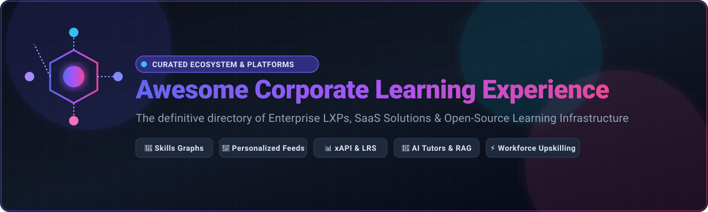
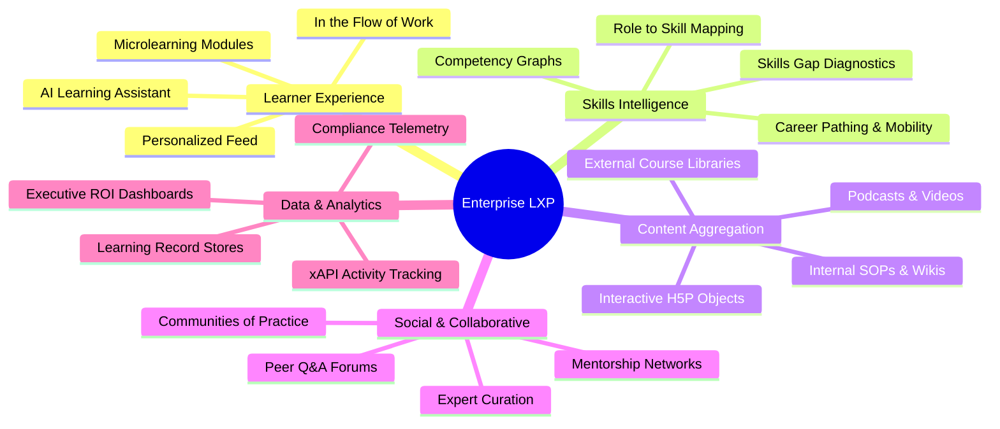

<div align="center">



# 🌟 Awesome Corporate Learning Experience (LXP) Ecosystem

[](https://github.com/ishandutta2007/Awesome-Awesome-Awesome)<a href="https://discord.gg/jc4xtF58Ve"></a>
[](http://makeapullrequest.com)
[](https://opensource.org/licenses/MIT)
<a href="https://github.com/ishandutta2007"></a>

**The comprehensive, curated guide to Enterprise Learning Experience Platforms (LXP), Workforce Upskilling Tools, SaaS Solutions & Open-Source Learning Architecture.**

*Personalized Learning • Skills Graphs • Content Aggregation • AI Learning Tutors • xAPI & LRS • Social Learning • Workforce Intelligence*

**Last updated: August 2026**

</div>

---

## 📖 Overview

A **Learning Experience Platform (LXP)** represents the evolution of corporate training from compliance-driven LMS systems to **learner-centric, AI-personalized, and skills-first ecosystems**. Modern LXPs empower organizations to aggregate external and internal content libraries, map organizational skill taxonomies, create adaptive learning journeys, and deliver microlearning directly in the flow of work (Slack, Microsoft Teams, browser extensions).

This repository is designed for **Chief Learning Officers (CLOs), L&D Leaders, HR Tech Architects, and Developers** looking to evaluate market-leading SaaS platforms or build modular, self-hosted corporate learning infrastructure using open-source building blocks.

---

## 📑 Table of Contents

- [🏢 SaaS / Hosted Enterprise Platforms](#-saas--hosted-enterprise-platforms)
- [💻 Open-Source GitHub Projects](#-open-source-github-projects)
  - [🏛️ LMS & LXP Core Foundations](#️-lms--lxp-core-foundations)
  - [🤖 AI Learning Assistants, LLMs & Agents](#-ai-learning-assistants-llms--agents)
  - [🔍 Search, Vector DBs & RAG](#-search-vector-dbs--rag)
  - [📊 Learning Analytics & Business Intelligence](#-learning-analytics--business-intelligence)
  - [📚 Knowledge Management & Social Learning](#-knowledge-management--social-learning)
  - [🔄 Workflow Orchestration & System Integration](#-workflow-orchestration--system-integration)
  - [🔐 Identity, Single Sign-On (SSO) & Access](#-identity-single-sign-on-sso--access)
  - [🎯 Recommendation & Personalization Engines](#-recommendation--personalization-engines)
  - [📦 Learning Record Stores (LRS) & xAPI](#-learning-record-stores-lrs--xapi)
  - [🎨 Content Creation & Interactive Authoring](#-content-creation--interactive-authoring)
  - [🧠 Skills Taxonomy & Competency Data](#-skills-taxonomy--competency-data)
- [🧩 Additional Strong Open-Source Options](#-additional-strong-open-source-options)
- [🏗️ Open-Source Composable LXP Architecture](#️-open-source-composable-lxp-architecture)
- [📐 Core LXP Functional Building Blocks](#-core-lxp-functional-building-blocks)
- [💡 Key Concepts in Corporate Learning Experience](#-key-concepts-in-corporate-learning-experience)
- [📈 Star History](#-star-history)
- [🤝 How to Contribute](#-how-to-contribute)
- [⚖️ Disclaimer](#️-disclaimer)

---

## 🏢 SaaS / Hosted Enterprise Platforms

*The table below compares prominent commercial LXP, LMS/LXP hybrid, and enterprise content aggregation providers, sorted in descending order by estimated company valuation / market capitalization / revenue.*

| Platform | Company Size (Valuation / Market Cap / Revenue) | Focus & Capabilities | Pricing (Starting Tier) | Free Tier / Free Trial Limits |
| :--- | :--- | :--- | :--- | :--- |
| **[LinkedIn Learning](https://learning.linkedin.com/)** | **~$3.1T Market Cap** (Microsoft parent / ~$15B+ LinkedIn Rev) | Enterprise learning-content platform providing 20,000+ expert-led video courses, role-based pathways, Skill Assessments, and deep LinkedIn profile integration. | Individual plan starts at $29.99/month (or $239.88/year billed annually); Team plan starts at $379.88/user/year (2–20 seats) | 30-day (1 month) free trial for individual/team accounts (unlimited access to 20,000+ video courses, practice files, and certificates) |
| **[Oracle Learning](https://www.oracle.com/human-capital-management/learning/)** | **~$380B+ Market Cap** ($53B Annual Revenue) | Comprehensive enterprise learning platform natively integrated into Oracle Fusion Cloud HCM with AI-driven recommendations, skills tracking, and compliance management. | Oracle Fusion Cloud HCM Learning module list price starts at $2.00/user/month ($24.00/user/year) | Oracle Cloud Free Tier provides $300 cloud credits for 30 days; 30-day guided HCM pilot sandbox upon enterprise sales engagement |
| **[SAP SuccessFactors Learning](https://www.sap.com/products/hcm/learning.html)** | **~$260B+ Market Cap** ($35B Annual Revenue) | Scalable talent development and learning management platform embedded within SAP HCM ecosystem, supporting global compliance, structured curricula, and career growth. | Starts at ~$2.17–$4.50/user/month (~$26.00–$54.00/user/year as an HCM module add-on; minimum annual contract ~$10,000–$25,000/year) | 30-day free trial of SAP SuccessFactors HCM suite (shared multi-tenant environment with pre-populated demo learner profiles, no custom data upload) |
| **[Workday Learning](https://www.workday.com/)** | **~$70B+ Market Cap** ($7.3B Annual Revenue) | Unified workforce learning and skills development platform built on the Workday Skills Cloud, delivering contextual learning in the flow of daily work. | Starts at ~$5.00–$8.00/user/month (~$60.00–$96.00/user/year as a Workday HCM module add-on; minimum annual contract ~$50,000/year) | 30-day guided proof-of-concept demo environment for existing Workday HCM customers through sales evaluation (no standalone public self-service trial) |
| **[Cornerstone Learning Experience](https://www.cornerstoneondemand.com/)** | **$5.2B Valuation** (Clearlake Capital buyout / ~$1.0B+ Rev) | Enterprise talent agility and learning experience platform offering AI-curated pathways, skills ontology (SkyHive), automated content curation, and deep compliance LMS foundations. | Starts at ~$6.00/user/month (~$72.00/user/year, with typical entry contract threshold around $25,000/year) | 14-to-30-day guided evaluation sandbox upon sales request (restricted test environment with sample learner data) |
| **[Pluralsight](https://www.pluralsight.com/business)** | **$3.5B Valuation** (Vista Equity Partners buyout / ~$450M ARR) | Technology and developer skills platform providing Skill IQ, Role IQ assessments, cloud labs, interactive sandboxes, and targeted engineering pathways. | Individual Starter starts at $29.00/month ($299.00/year); Skills Team plan starts at $399.00/user/year (up to 10 users) | 10-day free trial (up to 200 minutes of content or 10 days, access to course library, Skill IQ, and Role IQ assessments; sandboxes limited) |
| **[Go1](https://www.go1.com/)** | **$2.0B+ Valuation** (Unicorn / ~$100M+ ARR) | Leading corporate learning content aggregator connecting hundreds of top providers (Blinkist, Skillsoft, edX, Coursera) into a single unified subscription and API. | Premium subscription starts at ~$4.00–$8.00/user/month (~$48.00–$96.00/user/year, typically 20-seat minimum) | 14-day free trial (access to full content aggregator library, curated playlists, and LMS/LXP integration preview) |
| **[Docebo](https://www.docebo.com/)** | **~$1.4B Market Cap** (Nasdaq: DCBO / ~$200M ARR) | AI-powered enterprise learning platform combining LMS and LXP functionality with automated tagging, virtual coaching, social learning (Discover, Coach & Share), and white-label portals. | Elevate / Growth tier starts at ~$25,000/year (approx. $5.00–$8.00/user/month for ~300+ monthly active users) | 14-day free trial upon request (single admin, sandbox tenant with sample content and user management) |
| **[Degreed](https://degreed.com/)** | **$1.4B Valuation** (Series D Unicorn / ~$100M+ ARR) | Pioneer enterprise LXP and workforce skills platform featuring personalized learning feeds, skill profiles, internal mobility, pathway curation, and integrations across all LMS/HRIS tools. | Free for individual accounts; Enterprise tier starts at ~$10.00–$15.00/user/month (~$120–$180/user/year, typically ~$25,000 minimum annual contract) | Free-forever personal tier (1 user, individual skills tracking, pathway curation, content bookmarking; no enterprise SSO/admin); Enterprise sandbox/POC available upon sales request |
| **[Coursera for Business](https://www.coursera.org/business)** | **~$1.2B Market Cap** (NYSE: COUR / ~$650M Revenue) | Enterprise digital learning platform delivering university-backed degrees, Professional Certificates, hands-on Guided Projects, and enterprise Academy programs. | Team plan starts at $399.00/user/year (for 5 to 125 users; promotional rates from $279.30/user/year) | 14-day free trial / money-back evaluation window for Team plan (up to 5 users, access to 10,000+ courses, Guided Projects, and Skill Tracks) |
| **[Udemy Business](https://business.udemy.com/)** | **~$1.1B Market Cap** (Nasdaq: UDMY / ~$750M Revenue) | Scalable on-demand course marketplace offering thousands of practitioner-taught courses across tech, business, and leadership with customizable learning paths. | Team plan starts at $30.00/user/month billed annually ($360.00/user/year, for 2 to 20 users) | 14-day free trial for Team plan (up to 20 users, access to 11,000+ curated business and tech courses, learning paths, and analytics) |
| **[360Learning](https://360learning.com/)** | **~$800M Valuation** (Series C / ~$50M ARR) | Collaborative learning platform combining internal expert course creation, peer-to-peer social interaction, AI course generation, and integrated LMS capabilities. | Team plan starts at $8.00/user/month (up to 100 users, monthly or annual billing) | 30-day free trial (up to 100 users, full access to course authoring, AI assistant, mobile app, and learning paths) |
| **[Skillsoft Percipio](https://www.skillsoft.com/percipio)** | **~$550M Annual Revenue** (~$200M Market Cap, NYSE: SKIL) | Immersive learning experience and content platform featuring Skill Benchmarks, interactive coding sandboxes, curated Aspire Journeys, and multi-modal digital books/audiobooks. | Personal plan starts at $20.00/month (~$199.00/year); Team plan starts at ~$55.00/user/month (~$599.00/user/year); Enterprise volume rates scale to ~$50.00–$100.00/user/year | 14-day free trial (unlimited access to full course library, books, audiobooks, and Skill Benchmarks for 1 user/team) |
| **[EdCast](https://www.edcast.com/)** | **~$300M+ Valuation** (Acquired by Cornerstone / ~$40M ARR) | Enterprise AI-powered Knowledge Cloud and LXP specializing in unified knowledge discovery, smart cards, microlearning journeys, and deep corporate search. | Starts at ~$8.00–$12.00/user/month (~$96–$144/user/year, minimum annual contract ~$20,000) | 14-day guided proof-of-concept / sandbox trial upon sales request (sample tenant, limited test learners) |
| **[O'Reilly Learning](https://www.oreilly.com/online-learning/)** | **~$200M Annual Revenue** (Private) | Premier technical and business learning platform featuring thousands of authoritative books, live virtual events, interactive coding environments, and sandbox certifications. | Individual Premium starts at $49.00/month ($499.00/year); Team plan starts at $499.00/user/year (small-to-mid teams) | 10-day free trial (unlimited access to full catalog of books, audiobooks, video courses, interactive sandboxes, and certification guides) |
| **[Disprz](https://disprz.com/)** | **~$150M Valuation** (Series C / ~$20M ARR) | AI-driven workforce capability and frontline learning platform offering skill matrices, microlearning flashcards, interactive webinars, and automated assessment generators. | Starts at $2.50–$4.00/user/month (~$30.00–$48.00/user/year, onboarding minimum ~$3,000/year) | 14-day interactive demo / trial environment upon request (up to 25 test learners) |
| **[Thrive Learning](https://www.thrivelearning.com/)** | **~$120M Valuation** (Private Equity-backed / ~$25M ARR) | All-in-one modern LXP and lightweight LMS offering a social-first user feed, AI auto-tagging, internal community channels, campaign managers, and collaborative peer mentoring. | Starts at £5.00–£8.00/user/month (~$6.50–$10.50/user/month, minimum annual commitment starting around £15,000/year) | 30-day trial / sandbox access upon request (full features including social feed, AI discovery, and compliance modules) |
| **[Schoox](https://www.schoox.com/)** | **~$60M Valuation** (Private / ~$18M ARR) | Flexible corporate training and people development platform balancing compliance tracking with social learning communities and frontline job-role certifications. | Starts at ~$4.00–$6.00/user/month (or starting tier base package around $2,000–$5,000/year) | 14-day guided trial / sandbox on sales qualification (course builder, social learning, mobile learning access) |
| **[Fuse Universal](https://www.fuseuniversal.com/)** | **~$60M Valuation** (Private Equity-backed / ~$15M ARR) | Next-generation learning and knowledge hub prioritizing video-based microlearning, tacit knowledge capture, employee Q&A communities, and active social discussions. | Starts at ~$4.00–$8.00/user/month (minimum annual contract entry starting around $25,000/year) | 14-to-30-day sandbox pilot upon sales request (sample communities, video ingestion, and microlearning feeds) |
| **[HowNow](https://www.gethownow.com/)** | **~$50M Valuation** (Series A / ~$10M ARR) | Intelligent learning and knowledge platform emphasizing contextual learning in the flow of work, browser extensions, AI learning assistants, and auto-curated feeds. | Essentials plan starts at £60.00/user/year (~£5.00/user/month or ~$6.50/user/month); Pro plan starts at £80.00/user/year | 14-day free trial (full access to AI knowledge discovery, browser extension, integrations, and pathway builder) |
| **[Valamis](https://www.valamis.com/)** | **~$32M (€30M) Annual Revenue** (Private) | End-to-end enterprise learning ecosystem delivering customized learning pathways, integrated LRS (xAPI) analytics, eCommerce, and strategic workforce skills development. | Starts at ~$1.50–$4.00/user/month (or ~€30,000/year base entry for enterprise deployment) | 30-day proof-of-concept / guided trial environment upon demo request |
| **[Learn Amp](https://www.learnamp.com/)** | **~$30M Valuation** (Seed-funded / ~$5M ARR) | Integrated People Development Hub uniting LXP, LMS, employee engagement, performance check-ins, OKRs, and social learning into a single frictionless portal. | Starts at £3.50–£6.00/user/month (~$4.50–$8.00/user/month, base entry package from £250/month or £20,000/year enterprise) | 14-day free trial (available for organizations with <200 employees, access to core LMS/LXP and engagement features) |
| **[Moodle Workplace](https://moodle.com/workplace/)** | **~$25M Annual Revenue** (Moodle Pty Ltd / Certified Partners) | Enterprise-grade distribution of Moodle built specifically for corporate training, featuring multi-tenancy, automated rule engines, certificate programs, and custom report builders. | Partner-hosted packages start at ~$3,500–$6,000/year (or ~$3.00–$5.00/user/month); core Moodle LMS is free open source | Open-source Moodle LMS is free forever; Moodle Workplace hosted demo / 30-day trial sandbox available via authorized Moodle Partners (sample corporate multi-tenancy and compliance reports) |

---

## 💻 Open-Source GitHub Projects

> 💡 **Architectural Note:** A commercial LXP like Degreed or 360Learning is fundamentally a **composable system**. You can build an enterprise-ready, cost-effective, self-hosted corporate learning ecosystem by orchestrating open-source components: **LMS Foundation + Content Aggregator + xAPI/LRS + Vector Search & RAG + Recommendation Engine + Social Knowledge Hub + Analytics**.
> 
> *Repositories in each category below are sorted in descending order by their GitHub Star counts.*

---

### 🏛️ LMS & LXP Core Foundations

*The core learning delivery engines responsible for user management, structured courses, cohorts, and certification workflows.*

1. **[BigBlueButton](https://github.com/bigbluebutton/bigbluebutton)** [](https://github.com/bigbluebutton/bigbluebutton/stargazers)  
   Complete open-source virtual classroom and live training platform supporting breakout rooms, multi-user whiteboard, real-time polling, screen sharing, and deep LMS integrations.

2. **[Moodle](https://github.com/moodle/moodle)** [](https://github.com/moodle/moodle/stargazers)  
   The world's most widely deployed open-source learning management system with thousands of community plugins, competency tracking, conditional access rules, and multi-language support.

3. **[Open edX Platform](https://github.com/openedx/edx-platform)** [](https://github.com/openedx/edx-platform/stargazers)  
   Industrial-grade learning platform powering edX and global enterprise corporate academies, featuring modular XBlock architecture, rich grading engines, cohort management, and scalable microservices.

4. **[Oppia](https://github.com/oppia/oppia)** [](https://github.com/oppia/oppia/stargazers)  
   Interactive, exploratory learning tool enabling creation and sharing of guided, personalized learning simulations and micro-lessons with automated feedback loops.

5. **[Canvas LMS](https://github.com/instructure/canvas-lms)** [](https://github.com/instructure/canvas-lms/stargazers)  
   Robust, open-source LMS featuring modern REST APIs, SpeedGrader assessment workflows, discussion boards, LTI 1.3 tool interoperability, and notifications.

6. **[Frappe Learning](https://github.com/frappe/lms)** [](https://github.com/frappe/lms/stargazers)  
   Modern, sleek open-source LMS built on the Frappe framework supporting structured video courses, cohort batches, assessments, certificates, and live classes.

7. **[ClassroomIO](https://github.com/classroomio/classroomio)** [](https://github.com/classroomio/classroomio/stargazers)  
   Modern open-source e-learning platform crafted for running cohort-based courses, tracking progress, administering quizzes, and sharing student certificates.

8. **[Open edX Tutor](https://github.com/openedx/tutor)** [](https://github.com/openedx/tutor/stargazers)  
   Official Docker-based distribution and orchestration tool for deploying, configuring, and scaling Open edX environments with zero friction.

9. **[Chamilo LMS](https://github.com/chamilo/chamilo-lms)** [](https://github.com/chamilo/chamilo-lms/stargazers)  
   Open-source corporate e-learning and LMS suite supporting SCORM compliance, skill wheels, multi-tenant administrative structures, and automated exam generation.

10. **[Kolibri](https://github.com/learningequality/kolibri)** [](https://github.com/learningequality/kolibri/stargazers)  
    Offline-first learning platform and content ecosystem designed for remote, disconnected, or distributed workforce training deployments.

11. **[OpenEduCat](https://github.com/openeducat/openeducat_erp)** [](https://github.com/openeducat/openeducat_erp/stargazers)  
    Open-source enterprise education management and ERP system built on Odoo, combining LMS, student information management, and billing.

12. **[ILIAS](https://github.com/ILIAS-eLearning/ILIAS)** [](https://github.com/ILIAS-eLearning/ILIAS/stargazers)  
    Enterprise-oriented open-source LMS featuring integrated collaborative workspaces, repository-based learning materials, assessments, and SCORM/LTI support.

13. **[Sakai](https://github.com/sakaiproject/sakai)** [](https://github.com/sakaiproject/sakai/stargazers)  
    Flexible, enterprise-tested open-source learning collaboration system providing rich assignment workflows, gradebooks, forums, and syllabus organizers.

14. **[Forma LMS](https://github.com/formalms/forma)** [](https://github.com/formalms/forma/stargazers)  
    Open-source LMS tailored specifically for corporate training, featuring organizational chart mapping, skill matrices, mandatory compliance tracking, and certificate generators.

15. **[OpenLXP](https://github.com/educateschools/openlxp)** [](https://github.com/educateschools/openlxp/stargazers)  
    Open-source microservices-based Learning Experience Platform designed explicitly to index, aggregate, discover, and deliver personalized learning experiences across disparate systems.

---

### 🤖 AI Learning Assistants, LLMs & Agents

*Autonomous agents, RAG engines, and conversational AI tutors that generate quizzes, answer learner questions, and guide upskilling.*

1. **[LangChain](https://github.com/langchain-ai/langchain)** [](https://github.com/langchain-ai/langchain/stargazers)  
   The industry-standard open-source framework for assembling LLM-powered learning agents, semantic doc search, automated quiz generation, and adaptive reasoning workflows.

2. **[Open WebUI](https://github.com/open-webui/open-webui)** [](https://github.com/open-webui/open-webui/stargazers)  
   Feature-rich, self-hosted AI interface for deploying internal corporate learning assistants, document Q&A bots, and role-playing training scenarios.

3. **[Dify](https://github.com/langgenius/dify)** [](https://github.com/langgenius/dify/stargazers)  
   Production-ready open-source LLM app development platform for visual prompt engineering, enterprise RAG pipelines, and automated learning-pathway builders.

4. **[LlamaIndex](https://github.com/run-llama/llama_index)** [](https://github.com/run-llama/llama_index/stargazers)  
   Data framework for connecting LLMs to enterprise training manuals, SCORM packages, PDFs, and video transcripts for high-accuracy semantic retrieval.

5. **[Flowise](https://github.com/FlowiseAI/Flowise)** [](https://github.com/FlowiseAI/Flowise/stargazers)  
   Drag-and-drop UI to build customized LLM learning flows, conversational agents, and corporate training chatbots using LangChain and LlamaIndex.

6. **[AnythingLLM](https://github.com/Mintplex-Labs/anything-llm)** [](https://github.com/Mintplex-Labs/anything-llm/stargazers)  
   All-in-one private enterprise AI application for turning corporate knowledge bases, documentation, and training guides into secure interactive conversational workspaces.

7. **[Haystack](https://github.com/deepset-ai/haystack)** [](https://github.com/deepset-ai/haystack/stargazers)  
   Modular open-source NLP and RAG framework for building semantic search pipelines, extractive QA, and customized corporate knowledge bots.

8. **[LangGraph](https://github.com/langchain-ai/langgraph)** [](https://github.com/langchain-ai/langgraph/stargazers)  
   Library for building cyclic, multi-actor stateful AI agents capable of acting as autonomous tutors, simulated interviewers, and personalized career coaches.

---

### 🔍 Search, Vector DBs & RAG

*Search engines and vector databases that power semantic course discovery, unified document indexing, and contextual in-the-flow retrieval.*

1. **[Elasticsearch](https://github.com/elastic/elasticsearch)** [](https://github.com/elastic/elasticsearch/stargazers)  
   Distributed, JSON-based search and analytics engine for full-text search, course catalogs, skills indexing, and learning log aggregation.

2. **[Meilisearch](https://github.com/meilisearch/meilisearch)** [](https://github.com/meilisearch/meilisearch/stargazers)  
   Blazing fast, typo-tolerant, instant-as-you-type search engine perfect for consumer-grade corporate course catalogs and knowledge exploration.

3. **[Milvus](https://github.com/milvus-io/milvus)** [](https://github.com/milvus-io/milvus/stargazers)  
   Cloud-native vector database engineered for massive-scale semantic similarity search, hybrid dense/sparse retrieval, and AI learning embeddings.

4. **[Qdrant](https://github.com/qdrant/qdrant)** [](https://github.com/qdrant/qdrant/stargazers)  
   High-performance Rust-based vector search engine with payload filtering, making it ideal for filtering learning recommendations by department, role, or skill level.

5. **[Typesense](https://github.com/typesense/typesense)** [](https://github.com/typesense/typesense/stargazers)  
   In-memory, open-source typo-tolerant search engine providing an effortless developer experience for lightning-fast employee course search.

6. **[Chroma](https://github.com/chroma-core/chroma)** [](https://github.com/chroma-core/chroma/stargazers)  
   Developer-friendly open-source embedding database for prototyping and deploying lightweight semantic search and RAG for internal training courses.

7. **[SearXNG](https://github.com/searxng/searxng)** [](https://github.com/searxng/searxng/stargazers)  
   Privacy-respecting, hackable metasearch engine capable of aggregating search queries across internal and external corporate knowledge sources.

8. **[Weaviate](https://github.com/weaviate/weaviate)** [](https://github.com/weaviate/weaviate/stargazers)  
   Open-source vector database with built-in hybrid search, multi-modal vectorization, and graph-like relational structures for deep skills-to-content matching.

9. **[OpenSearch](https://github.com/opensearch-project/OpenSearch)** [](https://github.com/opensearch-project/OpenSearch/stargazers)  
   Community-driven, 100% open-source search and analytics suite offering vector search capabilities and enterprise-grade learning log aggregation.

10. **[Apache Solr](https://github.com/apache/solr)** [](https://github.com/apache/solr/stargazers)  
    Reliable enterprise search platform built on Apache Lucene for high-volume full-text and faceted search across learning repositories.

---

### 📊 Learning Analytics & Business Intelligence

*Dashboards, metrics, and visualization engines for measuring completion rates, skill progression, ROI, and compliance telemetry.*

1. **[Grafana](https://github.com/grafana/grafana)** [](https://github.com/grafana/grafana/stargazers)  
   Operational visualization and analytics platform for real-time telemetry, learner platform activity monitoring, and infrastructure health metrics.

2. **[Apache Superset](https://github.com/apache/superset)** [](https://github.com/apache/superset/stargazers)  
   Modern enterprise business intelligence platform providing interactive charts, drill-down dashboards, and SQL exploration for workforce skill gaps and completion rates.

3. **[Metabase](https://github.com/metabase/metabase)** [](https://github.com/metabase/metabase/stargazers)  
   Intuitive self-service analytics and dashboard platform allowing L&D managers and HR teams to query learning records without writing SQL.

---

### 📚 Knowledge Management & Social Learning

*Peer-to-peer discussions, team wikis, and tacit knowledge capture tools that enable collaborative learning and communities of practice.*

1. **[Discourse](https://github.com/discourse/discourse)** [](https://github.com/discourse/discourse/stargazers)  
   The gold standard in modern community discussion platforms, perfect for fostering corporate communities of practice, peer Q&A, and cohort interaction.

2. **[AFFiNE](https://github.com/toeverything/AFFiNE)** [](https://github.com/toeverything/AFFiNE/stargazers)  
   Next-generation all-in-one collaborative workspace combining canvas whiteboard, markdown notes, and structured knowledge management for team learning.

3. **[Outline](https://github.com/outline/outline)** [](https://github.com/outline/outline/stargazers)  
   Fast, collaborative, beautifully designed knowledge base and team wiki built with Node.js and React for corporate standard operating procedures and documentation.

4. **[Wiki.js](https://github.com/requarks/wiki)** [](https://github.com/requarks/wiki/stargazers)  
   Powerful Node.js-based open-source wiki software with visual markdown/WYSIWYG editors, Git synchronization, and enterprise authentication.

5. **[BookStack](https://github.com/BookStackApp/BookStack)** [](https://github.com/BookStackApp/BookStack/stargazers)  
   Simple, self-hosted, structured documentation platform organized around Books, Chapters, and Pages for internal training handbooks.

6. **[Gollum](https://github.com/gollum/gollum)** [](https://github.com/gollum/gollum/stargazers)  
   Simple, Git-powered wiki with a clean frontend supporting multiple markup formats, versioning, and seamless developer onboarding workflows.

7. **[MediaWiki](https://github.com/wikimedia/mediawiki)** [](https://github.com/wikimedia/mediawiki/stargazers)  
   The battle-tested collaborative wiki engine powering Wikipedia, scalable to millions of internal knowledge pages and cross-referenced resources.

---

### 🔄 Workflow Orchestration & System Integration

*Automation platforms that connect HRIS (Workday, BambooHR), LMS, LXP, messaging platforms (Slack, Teams), and content feeds.*

1. **[n8n](https://github.com/n8n-io/n8n)** [](https://github.com/n8n-io/n8n/stargazers)  
   Fair-code workflow automation tool with extensive pre-built nodes for integrating HRIS events, automated course enrollments, certificate dispatch, and Slack notifications.

2. **[Apache Airflow](https://github.com/apache/airflow)** [](https://github.com/apache/airflow/stargazers)  
   Programmatic workflow orchestration platform for scheduling ETL pipelines, calculating night-time skill matrix updates, and aggregating xAPI events.

3. **[Node-RED](https://github.com/node-red/node-red)** [](https://github.com/node-red/node-red/stargazers)  
   Low-code event-driven programming platform for wiring together corporate webhooks, IoT devices, LMS triggers, and messaging services.

4. **[Temporal](https://github.com/temporalio/temporal)** [](https://github.com/temporalio/temporal/stargazers)  
   Durable, distributed code-as-configuration execution engine ideal for long-running employee onboarding workflows and multi-step learning tracks.

---

### 🔐 Identity, Single Sign-On (SSO) & Access

*Identity providers and authentication middlewares supporting SAML 2.0, OpenID Connect, OAuth2, and SCIM provisioning for seamless corporate logins.*

1. **[Keycloak](https://github.com/keycloak/keycloak)** [](https://github.com/keycloak/keycloak/stargazers)  
   Comprehensive open-source Identity and Access Management solution offering SSO, user federation (LDAP/AD), fine-grained role authorization, and social logins.

2. **[Authelia](https://github.com/authelia/authelia)** [](https://github.com/authelia/authelia/stargazers)  
   Lightweight authentication server providing single sign-on and multi-factor authentication (2FA) for protecting internal learning dashboards and tools.

3. **[Authentik](https://github.com/goauthentik/authentik)** [](https://github.com/goauthentik/authentik/stargazers)  
   Versatile open-source identity provider with built-in SCIM provisioning, passwordless authentication, user flows, and SAML/OIDC gateways.

---

### 🎯 Recommendation & Personalization Engines

*Collaborative filtering and machine learning recommendation algorithms for constructing personalized "Netflix for Learning" content feeds.*

1. **[TensorFlow Recommenders](https://github.com/tensorflow/recommenders)** [](https://github.com/tensorflow/recommenders/stargazers)  
   Comprehensive library for building deep-learning-based two-tower retrieval and ranking recommendation models for enterprise learning feeds.

2. **[Surprise](https://github.com/NicolasHug/Surprise)** [](https://github.com/NicolasHug/Surprise/stargazers)  
   Python scikit for building and analyzing recommender systems with explicit rating datasets, matrix factorization (SVD), and nearest-neighbor models.

3. **[Implicit](https://github.com/benfred/implicit)** [](https://github.com/benfred/implicit/stargazers)  
   Fast Python implementation of collaborative filtering algorithms (Alternating Least Squares, BPR) for implicit feedback (clicks, completions, views).

4. **[RecBole](https://github.com/RUCAIBox/RecBole)** [](https://github.com/RUCAIBox/RecBole/stargazers)  
   Unified, comprehensive PyTorch recommendation benchmark library implementing over 90 state-of-the-art recommendation models.

5. **[LightFM](https://github.com/lyst/lightfm)** [](https://github.com/lyst/lightfm/stargazers)  
   Python implementation of hybrid recommendation algorithms combining user/item metadata (job role, skills, tags) with interaction histories.

6. **[NVIDIA Merlin](https://github.com/NVIDIA-Merlin/Merlin)** [](https://github.com/NVIDIA-Merlin/Merlin/stargazers)  
   High-performance GPU-accelerated recommendation framework designed to scale feature transformation, training, and inference to millions of items.

7. **[LensKit](https://github.com/lenskit/lenskit)** [](https://github.com/lenskit/lenskit/stargazers)  
   Flexible Python toolkit for developing, evaluating, and researching transparent, reproducible recommender systems.

---

### 📦 Learning Record Stores (LRS) & xAPI

*Experience API (xAPI / Tin Can) data infrastructure for capturing granular learning activities outside traditional LMS environments.*

1. **[Learning Locker](https://github.com/LearningLocker/learninglocker)** [](https://github.com/LearningLocker/learninglocker/stargazers)  
   Open-source Learning Record Store (LRS) for ingesting, validating, aggregating, and visualizing xAPI statement streams across multiple learning channels.

2. **[ADL xAPI Specification](https://github.com/adlnet/xAPI-Spec)** [](https://github.com/adlnet/xAPI-Spec/stargazers)  
   The official Experience API specification defining statement structures (`Actor`, `Verb`, `Object`) for tracking any human learning activity.

3. **[lrsql (Yet Analytics)](https://github.com/yetanalytics/lrsql)** [](https://github.com/yetanalytics/lrsql/stargazers)  
   Modern, high-performance SQL-backed xAPI Learning Record Store built in Clojure with an administrative UI and compliance test validation.

4. **[Learning Locker xAPI Service](https://github.com/LearningLocker/xapi-service)** [](https://github.com/LearningLocker/xapi-service/stargazers)  
   Dedicated, high-throughput microservice for processing and writing xAPI statements into Learning Locker clusters.

5. **[TinCanPython](https://github.com/RusticiSoftware/TinCanPython)** [](https://github.com/RusticiSoftware/TinCanPython/stargazers)  
   Python client library developed by Rustici Software for generating, sending, and retrieving xAPI statements.

6. **[SCORM Again](https://github.com/bennothommo/scorm-again)** [](https://github.com/bennothommo/scorm-again/stargazers)  
   Modern JavaScript SCORM 1.2 and 2004 runtime wrapper for launching, playing, and bridging legacy SCORM packages into modern web applications.

---

### 🎨 Content Creation & Interactive Authoring

*Tools for authoring responsive, interactive, and microlearning content objects compatible with SCORM, xAPI, and HTML5 standards.*

1. **[H5P Core](https://github.com/h5p/h5p)** [](https://github.com/h5p/h5p/stargazers)  
   Modular interactive HTML5 content authoring framework providing interactive videos, branch scenarios, memory games, quizzes, and LMS embeddability.

2. **[Adapt Framework](https://github.com/adaptlearning/adapt_framework)** [](https://github.com/adaptlearning/adapt_framework/stargazers)  
   Open-source, responsive HTML5 e-learning authoring framework designed to produce modern, mobile-friendly multi-device learning packages.

3. **[Open edX XBlock](https://github.com/openedx/XBlock)** [](https://github.com/openedx/XBlock/stargazers)  
   Component architecture standard for building rich, interactive, pluggable learning widgets and simulations inside Open edX environments.

---

### 🧠 Skills Taxonomy & Competency Data

*Open vocabularies and semantic knowledge graphs for constructing job roles, competency models, and skill-gap diagnostics.*

1. **[Wikidata Query GUI & Graph](https://github.com/wikimedia/wikidata-query-gui)** [](https://github.com/wikimedia/wikidata-query-gui/stargazers)  
   Global knowledge graph providing ontological relationships between technology skills, academic disciplines, professional certifications, and industries.

2. **[OpenAlex](https://github.com/ourresearch/openalex-guts)** [](https://github.com/ourresearch/openalex-guts/stargazers)  
   Massive open index of scholarly articles, researchers, topics, and institutions useful for enterprise R&D knowledge discovery and subject-matter expert identification.

3. **[ESCO Classification](https://esco.ec.europa.eu/)**  
   European Skills, Competences, Qualifications and Occupations taxonomy identifying and categorizing over 3,000 occupations and 13,800 skills in 28 languages.

4. **[O*NET OnLine Taxonomies](https://www.onetcenter.org/)**  
   United States Department of Labor occupational database defining standardized skill requirements, work activities, and task profiles across industries.

---

## 🧩 Additional Strong Open-Source Options

*Quick-reference table of top open-source projects across functional layers, with real-time GitHub stargazer links.*

| Category | Project & Repository | GitHub Stars Badge | Primary Use Case |
| :--- | :--- | :--- | :--- |
| **LMS / LXP** | **[BigBlueButton](https://github.com/bigbluebutton/bigbluebutton)** | [](https://github.com/bigbluebutton/bigbluebutton/stargazers) | Live virtual classroom & webinars |
| **LMS / LXP** | **[Moodle](https://github.com/moodle/moodle)** | [](https://github.com/moodle/moodle/stargazers) | Extensible modular enterprise LMS |
| **LMS / LXP** | **[Open edX](https://github.com/openedx/edx-platform)** | [](https://github.com/openedx/edx-platform/stargazers) | Large-scale corporate academy engine |
| **LMS / LXP** | **[Canvas LMS](https://github.com/instructure/canvas-lms)** | [](https://github.com/instructure/canvas-lms/stargazers) | Enterprise learning management |
| **LMS / LXP** | **[Frappe LMS](https://github.com/frappe/lms)** | [](https://github.com/frappe/lms/stargazers) | Lightweight modern course delivery |
| **AI Agents** | **[LangChain](https://github.com/langchain-ai/langchain)** | [](https://github.com/langchain-ai/langchain/stargazers) | AI learning agents & RAG workflows |
| **AI UI** | **[Open WebUI](https://github.com/open-webui/open-webui)** | [](https://github.com/open-webui/open-webui/stargazers) | Internal conversational learning portal |
| **Search** | **[Elasticsearch](https://github.com/elastic/elasticsearch)** | [](https://github.com/elastic/elasticsearch/stargazers) | Enterprise document & course search |
| **Search** | **[Meilisearch](https://github.com/meilisearch/meilisearch)** | [](https://github.com/meilisearch/meilisearch/stargazers) | Instant typo-tolerant catalog search |
| **Vector DB** | **[Milvus](https://github.com/milvus-io/milvus)** | [](https://github.com/milvus-io/milvus/stargazers) | Scalable embeddings similarity search |
| **Vector DB** | **[Qdrant](https://github.com/qdrant/qdrant)** | [](https://github.com/qdrant/qdrant/stargazers) | Filtered vector retrieval by department |
| **Analytics** | **[Grafana](https://github.com/grafana/grafana)** | [](https://github.com/grafana/grafana/stargazers) | Real-time platform metric dashboards |
| **Analytics** | **[Apache Superset](https://github.com/apache/superset)** | [](https://github.com/apache/superset/stargazers) | Deep skill-gap and completion analytics |
| **Community** | **[Discourse](https://github.com/discourse/discourse)** | [](https://github.com/discourse/discourse/stargazers) | Communities of practice & social learning |
| **Knowledge** | **[Outline](https://github.com/outline/outline)** | [](https://github.com/outline/outline/stargazers) | Collaborative team knowledge base |
| **Workflow** | **[n8n](https://github.com/n8n-io/n8n)** | [](https://github.com/n8n-io/n8n/stargazers) | HRIS, LMS & Slack automation pipelines |
| **Identity** | **[Keycloak](https://github.com/keycloak/keycloak)** | [](https://github.com/keycloak/keycloak/stargazers) | Enterprise Single Sign-On (SSO) & LDAP |
| **xAPI / LRS** | **[Learning Locker](https://github.com/LearningLocker/learninglocker)** | [](https://github.com/LearningLocker/learninglocker/stargazers) | Learning Record Store telemetry |
| **Authoring** | **[H5P](https://github.com/h5p/h5p)** | [](https://github.com/h5p/h5p/stargazers) | Interactive HTML5 course widgets |
| **Recs Engine**| **[TensorFlow Recommenders](https://github.com/tensorflow/recommenders)** | [](https://github.com/tensorflow/recommenders/stargazers) | Deep learning content recommendation |

---

## 🏗️ Open-Source Composable LXP Architecture

*A production-ready reference architecture for composing custom corporate learning platforms using open-source infrastructure:*

```text
                        ┌─────────────────────────────────────────┐
                        │          👤 EMPLOYEE / LEARNER          │
                        │                                         │
                        │  Web UI • Mobile App • Slack • MS Teams │
                        │  Personalized Feed • Skill Progression  │
                        └───────────────────┬─────────────────────┘
                                            │
                                            ▼
                        ┌─────────────────────────────────────────┐
                        │      🖥️ LXP EXPERIENCE LAYER (UI)       │
                        │                                         │
                        │  OpenLXP / Frappe LMS / Open edX / Next │
                        │  Personalized Recommendation Feed       │
                        │  Role-Based Learning Pathways & Goals   │
                        └───────────────────┬─────────────────────┘
                                            │
                        ┌───────────────────┴─────────────────────┐
                        │                                         │
                        ▼                                         ▼
             ┌─────────────────────┐                   ┌─────────────────────┐
             │ 📦 CONTENT DELIVERY │                   │ 💬 SOCIAL KNOWLEDGE │
             │                     │                   │                     │
             │ H5P Interactive     │                   │ Discourse Hub       │
             │ Open edX Courses    │                   │ Outline / AFFiNE    │
             │ Frappe LMS Lessons  │                   │ Wiki.js / BookStack │
             │ SCORM-Again Bridge  │                   │ Peer Q&A & Mentors  │
             └──────────┬──────────┘                   └──────────┬──────────┘
                        │                                         │
                        └───────────────────┬─────────────────────┘
                                            │
                                            ▼
                        ┌─────────────────────────────────────────┐
                        │      🔍 SEARCH & SEMANTIC RETRIEVAL     │
                        │                                         │
                        │  Meilisearch • Elasticsearch • OpenSrch │
                        │  Qdrant • Milvus • Chroma • Weaviate    │
                        │  Contextual In-the-Flow-of-Work RAG     │
                        └───────────────────┬─────────────────────┘
                                            │
                        ┌───────────────────┴─────────────────────┐
                        │                                         │
                        ▼                                         ▼
             ┌─────────────────────┐                   ┌─────────────────────┐
             │ 🎯 RECOMMENDATIONS  │                   │ 🧠 SKILLS TAXONOMY  │
             │                     │                   │                     │
             │ TensorFlow Recs     │                   │ ESCO Framework      │
             │ LightFM / Implicit  │                   │ O*NET Occupations   │
             │ RecBole Models      │                   │ Wikidata Graph      │
             │ Collaborative Filter│                   │ Internal Skill Tree │
             └──────────┬──────────┘                   └──────────┬──────────┘
                        │                                         │
                        └───────────────────┬─────────────────────┘
                                            │
                                            ▼
                        ┌─────────────────────────────────────────┐
                        │       📊 LEARNING RECORDS & xAPI        │
                        │                                         │
                        │  Learning Locker • Yet Analytics lrsql  │
                        │  xAPI Statement Pipeline • Activity Bus │
                        └───────────────────┬─────────────────────┘
                                            │
                                            ▼
                        ┌─────────────────────────────────────────┐
                        │      📈 ANALYTICS & CAPABILITY BI       │
                        │                                         │
                        │  Apache Superset • Metabase • Grafana   │
                        │  Skills-Gap Diagnostics • Training ROI  │
                        └───────────────────┬─────────────────────┘
                                            │
                                            ▼
                        ┌─────────────────────────────────────────┐
                        │        🤖 AI LEARNING ASSISTANT         │
                        │                                         │
                        │  LangChain • LangGraph • LlamaIndex     │
                        │  Adaptive 24/7 AI Tutor & Coach         │
                        └─────────────────────────────────────────┘
```

---

## 📐 Core LXP Functional Building Blocks



---

## 💡 Key Concepts in Corporate Learning Experience

* **Learning Experience Platform (LXP) vs. Learning Management System (LMS):** An LMS primarily addresses administrative compliance, course catalog hosting, and mandatory testing from the employer's viewpoint. An LXP is an AI-driven, learner-centric layer designed to aggregate diverse resources, recommend content based on skill aspirations, and encourage social learning.
* **Learning in the Flow of Work (LitFoW):** The principle of surfacing bite-sized knowledge directly inside everyday tools (such as Slack, Teams, IDEs, or CRM software) at the exact moment a worker encounters a problem.
* **xAPI (Experience API / Tin Can):** An open interoperability standard that allows systems to record any learning event formatted as `[Actor] [Verb] [Object]` (e.g., *"Jane completed Python Data Analysis quiz"*), capturing experiences outside the conventional LMS.
* **Learning Record Store (LRS):** The database repository specified by xAPI to store, validate, and retrieve learning interaction data across distributed platforms.
* **Skills Graph / Taxonomy:** A structured ontology describing relationships between skills, proficiencies, job roles, and educational content to power automated career paths and talent mobility.

---

## 📈 Star History

[](https://star-history.dera.page/#ishandutta2007/Awesome-Corporate-Learning-Experience&type=date&legend=top-left)

---

## 🤝 How to Contribute

Contributions, updates, and corrections are warmly welcomed! Please follow these guidelines:

1. 🍴 **Fork the Repository** and create a feature branch (`git checkout -b feature/new-lxp-platform`).
2. 📝 **Add Your Resource:** Maintain alphabetical order within category sections or sort by star count/market size.
3. 🔎 **Fact-check Pricing & Limits:** Ensure SaaS entries contain exact pricing tiers and specific free trial conditions.
4. ✨ **Test Formatting:** Ensure valid GitHub Flavored Markdown and valid links.
5. 🚀 **Submit a Pull Request** with a concise description of your additions.

---

## ⚖️ Disclaimer

*All product names, logos, trademarks, and registered trademarks are property of their respective owners. Company valuations, market capitalizations, ARR figures, and pricing tiers reflect publicly available analyst estimates, official announcements, and industry procurement data as of August 2026 and are subject to continuous updates.*
